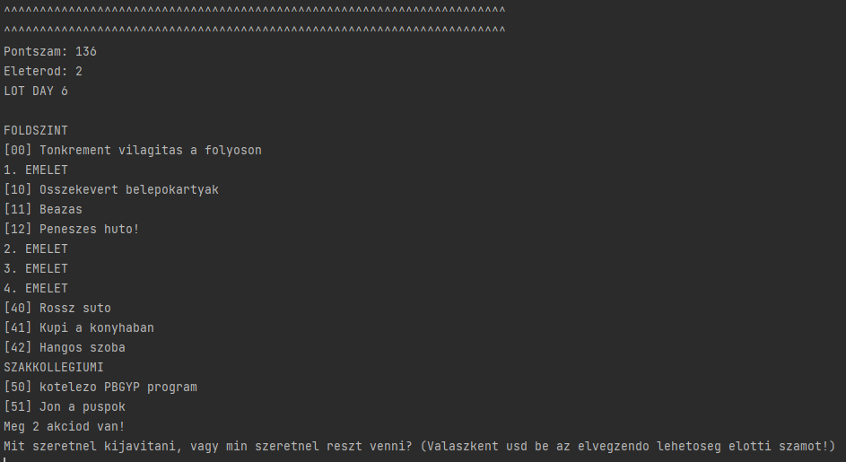

# LOT SIMULATOR

## Mi ez?

A LOT SIMULATOR egy egyszerű, konzolos játék (parancssorban, terminálban futtatható).
A játék a koleszunkból indul ki, annak előforduló problémáit szimulálja poénból.
(100% poénból, nyilván nem hivatott senkit, semmit megsérteni.)

### A játék célja

Minél több pontszámot összeszedni halál nélkül 15 LOT-beli nap (kör) alatt.

### A játék menete

A játékos egy LOT-ot reprezentáló felülettel találja szembe magát,
melybe minden nap újabb és újabb hibák spawnolnak.
Minden nap kiválaszthat összesen 2 hibát ("2 akció"), amit megszüntet, mindegyik
ér valamennyi  pontot. A nem megszüntetett hibák következményeket vonnak maguk után (ld. lentebb).

#### Diák és Főnökség boldogság bar
Na most, a játékban fut 2 másik pontszám, egyik a *Diák Boldogság*, a másik a *Főnökség boldogság*,
ezt a két pontszámot a játékos nem látja, ez a játékban a kihívás: találgatni lehet, melyik hiba mennyire
befolyásolja a kettőt.
A két pontszám (továbbiakban: bar) befolyásolja, mennyi és milyen hiba spawnol a LOT-ban. (Például ha a diákok
nem annyira elégedettek, nem figyelnek oda, és nem takarítják a hűtőt, ami bepenészedik). Ennek a mechanikáját
szintén a játékosnak kell kitapasztalnia, legfeljebb a kódban (és a dokumentációban) látszik, de a játék közben
semmiképpen sem értesítjük erről.

#### A Szakkollégiumi programok

A Szakkollégiumi programok speckó "hibák" a LOT-ban, amik nem érnek pontszámot akció elköltésekor, 
és amiket csak a Főnökség bar befolyásol. Ezeken a részvétel azonban kötelező: ha nem vesz a játékos rajta részt,
az nem csak nagyon kedvezőtlenül csökkenti a Fönökség bart, **hanem a HP-t is csökkenti.** 
Igen, **a 3. hiányzás után a játékos meghal.**

#### A hibák

Korábban már leírtuk, de bővebben: olyan entitások, amelyek nem-feloldás esetén a két bart befolyásolják,
és  minden körben egy bizonyos valószínűséggel spawnolnak (ezt a két bar befolyásolja, szóval visszacsatolás működik,
aminek a mechanikáját a játékos tapasztalja ki), valamint feloldás esetén az értékükkel növelik a játékos pontszámát.

#### A játék vége

Ha a játékos meghal (am. 3 HP-val kezd), vagy lejár a 15 nap.

## Szerkeszthetem, bővíthetem én is a játékot?

A válasz persze igen, ez az egész egy poén, úgy fejleszted, ahogy akarod. **Egy kérés**: külön branchbe dolgozz még,
amúgy meg írj nekem (Armand). Marha egyszerű játék, ami még hagy némi kívánnivalót maga után (: poén), de azért nem
két perc volt összedobni :) . Direkt úgy terveztem meg a megvalósítást, hogy könnyen módosítható, bővíthető legyen
(részletesebben nézd meg a dokumentációt), új hibatípusokat lehessen hozzáadni, a LOT-ot is simán bővíteni lehessen.
